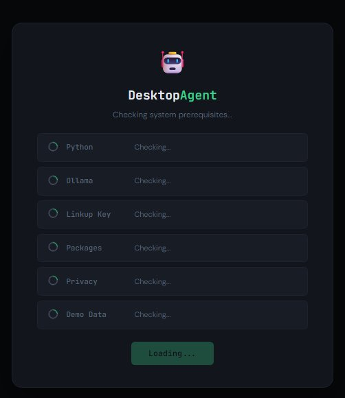
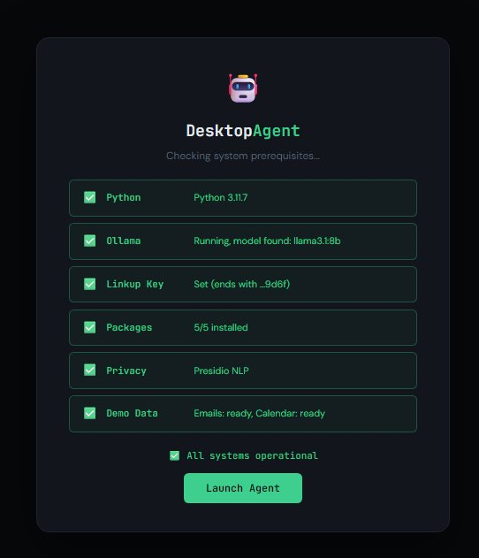
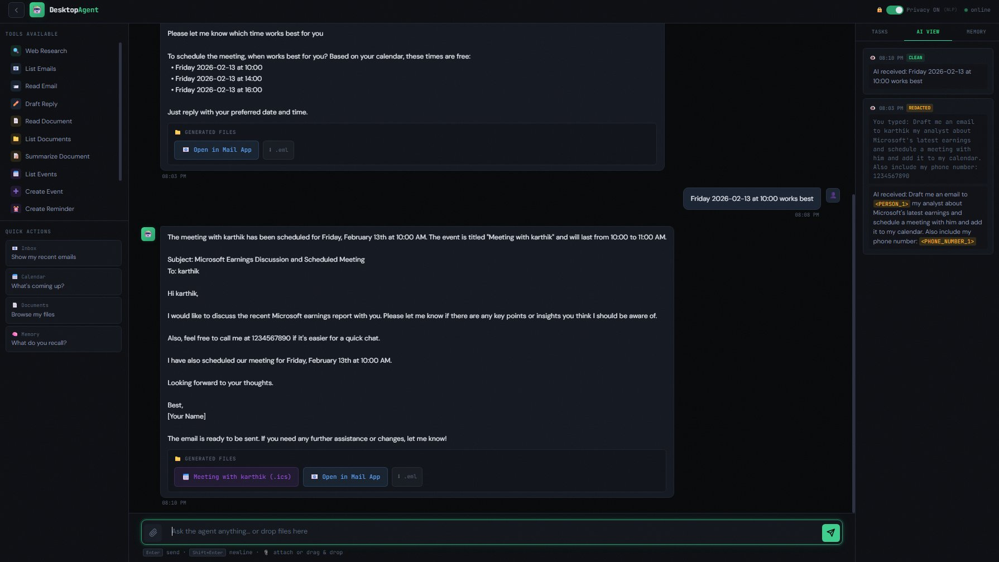

# 🤖 AGI Desktop Intelligence Agent

A privacy-first desktop assistant that uses a local LLM (Ollama), Linkup's agentic search API for real-time web knowledge, and 12 tools across 5 domains — all orchestrated by an autonomous Planner → Executor → Evaluator loop.

> 🔗 **[Interactive Architecture Diagram](https://gitreboot.github.io/HackwithDC-Team-6)** — animated, clickable system overview (or open `docs/architecture_diagram.html` locally)

---

## Features

**Multi-Domain Intelligence** — Email management, document analysis (PDF/DOCX/TXT), calendar scheduling, web research, and semantic memory — all through natural language.

**Privacy-First** — PII is automatically redacted before the LLM sees it. Names become `<PERSON_1>`, phones become `<PHONE_1>`. Company names, dates, and task-relevant context are preserved. Real values are restored in the final response and generated files.

**Linkup Web Search** — Agentic search for real-time research, fact-checking, and meeting prep. The agent decides when external knowledge is needed — not on every prompt. Only sanitized queries are sent.

**Autonomous Planning** — The agent decomposes complex multi-step requests into executable plans, selects tools, evaluates results, and retries on failure. A scheduling gate enforces that calendar events are only created when the user provides a confirmed date/time.

**Generated Files** — Email drafts open directly in your mail app (Outlook, Gmail, etc.) via `mailto:`. Calendar events download as `.ics` files. Both are accessible from download buttons in the chat.

---

## Screenshots

<p align="center">
  
  &nbsp;&nbsp;
  
</p>
<p align="center"><em>Setup screen checks all prerequisites on launch</em></p>

<br>

<p align="center">
  
</p>
<p align="center"><em>Multi-step workflow: email draft + scheduling gate + calendar event creation with privacy redaction (AI View panel)</em></p>

---

## Quick Start

### Prerequisites

- **Python 3.10+**
- **[Ollama](https://ollama.com)** — install and make sure the Ollama service is running (`ollama serve`)
- **[Linkup API key](https://linkup.so)** — sign up free at linkup.so → Dashboard → API Keys

### Setup

```bash
# 1. Clone the repo
git clone https://github.com/GitReboot/HackwithDC-Team-6.git
cd HackwithDC-Team-6

# 2. Install Python dependencies
pip install -r requirements.txt

# 3. Pull an Ollama model (make sure Ollama is running first)
ollama pull llama3.1:8b

# 4. Set your Linkup API key
# Windows CMD:
set LINKUP_API_KEY=your-key-here
# Windows PowerShell:
$env:LINKUP_API_KEY="your-key-here"
# Mac/Linux:
export LINKUP_API_KEY="your-key-here"

# 5. Start the web server
python server.py

# 6. Open http://localhost:5000 in your browser
#    The setup screen will check all prerequisites automatically
```

Demo emails and calendar events auto-seed on first launch — no extra setup needed.

### Optional: Better PII Detection

```bash
pip install presidio-analyzer presidio-anonymizer spacy
python -m spacy download en_core_web_sm
```

Without this, privacy still works using regex patterns.

### Recommended Models

| Model | RAM | Tool Calling | Best For |
|-------|-----|-------------|----------|
| `llama3.1:8b` (default) | 8 GB | Good | Any system |
| `qwen2.5:7b` | 8 GB | Very Good | Better structured output |
| `qwen2.5:14b` | 12 GB | Excellent | Best results if hardware allows |

Change model in `config/defaults.yaml`:
```yaml
agent:
  model: "qwen2.5:7b"
```

---

## Architecture

```
User Input → Privacy Layer → Planner → Executor → Evaluator → Synthesis → Response
                                          │
                    ┌─────────────────────┼──────────────────────┐
                    │                     │                      │
              Linkup Search      Local Tools (12)         Memory Store
              (web research)     Email · Docs · Calendar   SQLite + FAISS
```

The agent follows a **Planner → Executor → Evaluator** loop:
1. **Planner** decomposes goals into steps
2. **Executor** calls tools via LLM function-calling (with scheduling gate + PII restore)
3. **Evaluator** checks success and retries if needed
4. **Synthesis** combines results, strips false claims, restores PII

See [docs/architecture.md](docs/architecture.md) for the full design, or explore the [interactive diagram](https://gitreboot.github.io/HackwithDC-Team-6/architecture_diagram.html).

---

## Project Structure

```
desktop-agent/
├── main.py                    # CLI entry point
├── server.py                  # Flask web server + API
├── requirements.txt
├── config/
│   ├── __init__.py            # Config loader
│   └── defaults.yaml          # Default settings
├── agent/
│   ├── __init__.py
│   ├── planner.py             # Goal → step decomposition
│   ├── executor.py            # Tool calling + scheduling gate
│   ├── evaluator.py           # Success checking + retry
│   ├── loop.py                # Main orchestration loop
│   └── prompts.py             # System/plan/eval prompts
├── tools/
│   ├── __init__.py            # BaseTool + ToolRegistry
│   ├── linkup_client.py       # Linkup agentic search
│   ├── email_adapter.py       # IMAP + local mailbox + mailto
│   ├── document_adapter.py    # PDF/DOCX/TXT reader
│   ├── calendar_adapter.py    # .ics calendar (zero-dep)
│   ├── memory_tools.py        # Store/recall facts
│   └── privacy.py             # PII redaction engine
├── memory/
│   ├── __init__.py
│   ├── sqlite_store.py        # Conversation + task history
│   └── faiss_retriever.py     # Semantic similarity search
├── frontend/
│   └── index.html             # Web chat UI
└── docs/
    ├── architecture.md         # System design document
    ├── architecture_diagram.html  # Interactive animated diagram
    ├── linkup_integration.md   # Linkup usage documentation
    └── demo_scenarios.md       # Demo walkthrough
```

---

## Documentation

| Document | Description |
|----------|-------------|
| [architecture.md](docs/architecture.md) | Full system design — data flow, components, guardrails |
| [architecture_diagram.html](https://gitreboot.github.io/HackwithDC-Team-6/architecture_diagram.html) | Interactive animated architecture diagram |
| [linkup_integration.md](docs/linkup_integration.md) | How Linkup enhances agent capabilities |
| [demo_scenarios.md](docs/demo_scenarios.md) | Step-by-step demo walkthrough |

---

## Evaluation Criteria Mapping

| Criteria | Implementation |
|----------|---------------|
| **Generality** | 12 tools across 5 domains — email, documents, calendar, web search, memory |
| **Autonomy** | Planner → Executor → Evaluator loop with minimal hardcoded flows |
| **Reasoning** | LLM-driven planning, multi-step tool chaining, scheduling gate |
| **Context Awareness** | Short-term buffer + long-term semantic memory (FAISS) |
| **Information Synthesis** | Linkup for real-time web knowledge, result grounding |
| **Privacy & Security** | PII redaction, local-first processing, no data leaves machine |
| **Usability** | Web UI with chat, file attachments, AI View, generated file downloads |

---

## Health Check

Visit **http://localhost:5000/api/health** after starting the server to verify all prerequisites:

- Python version
- Ollama status and model availability
- Linkup API key
- Required packages
- Privacy engine (Presidio NLP or regex fallback)
- Demo data

The web UI also shows an interactive setup screen on launch that runs through these checks automatically.

---

## Future Scope

- **Streaming responses** — Real-time token-by-token output instead of waiting for the full response, significantly improving perceived speed
- **Conversation history** — Sidebar showing past sessions with the ability to resume or reference previous conversations
- **Multi-agent architecture** — Separate planner, researcher, and critic agents that collaborate on complex tasks
- **OAuth integrations** — Direct Google Calendar, Outlook, and Gmail connections instead of local file adapters
- **Voice input** — Speak commands instead of typing, with local speech-to-text processing
- **Plugin system** — Allow users to add custom tools without modifying core code

---

## Powered By

<div align="center">

[](https://ollama.com) &nbsp;&nbsp; [](https://linkup.so)

**[Ollama](https://ollama.com)** powers local LLM inference &nbsp;·&nbsp; **[Linkup](https://linkup.so)** provides agentic web search

</div>
